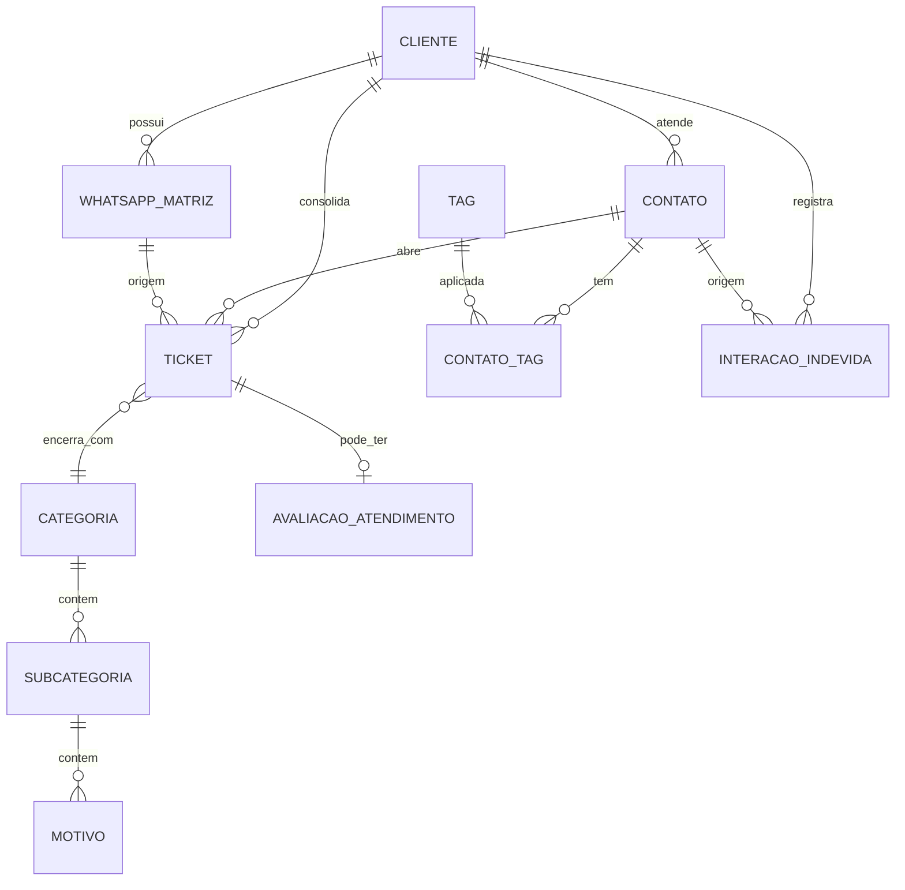
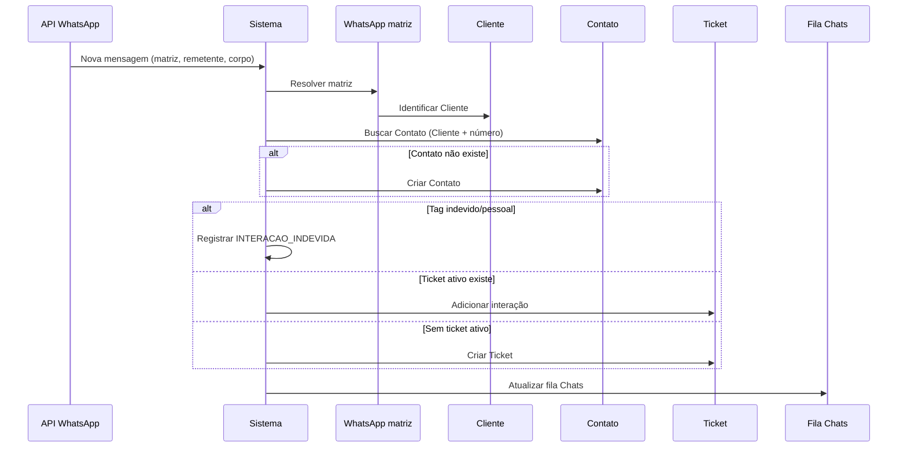
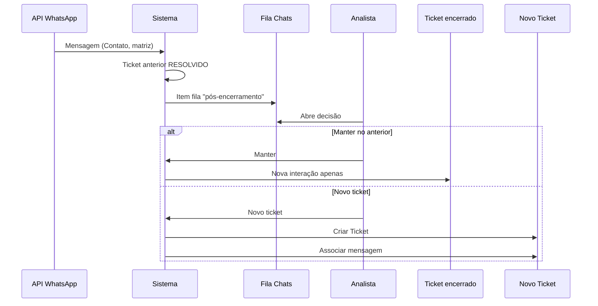
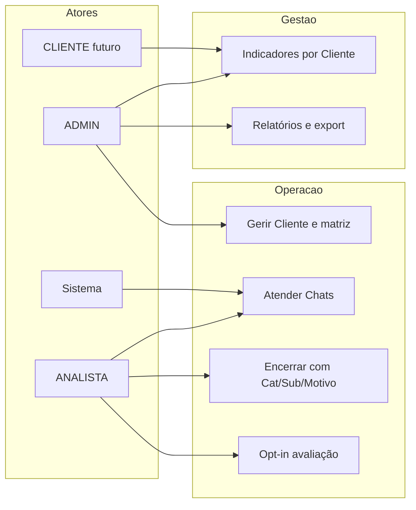

# Modelo oficial — Cliente / Contato / WhatsApp / Ticket

**Sprint 185** — documentação normativa de produto e arquitetura.  
**Status:** documento oficial (fonte da verdade para implementação futura).  
**Base técnica:** [COLETA_MODELO_CLIENTE_CONTATO_WHATSAPP_TICKET.md](./COLETA_MODELO_CLIENTE_CONTATO_WHATSAPP_TICKET.md) (Sprint 184).

> **Estratégia de implementação (Sprint 187):** o [plano conservador](./PLANO_COMPATIBILIDADE_CLIENTE_CONTATO.md) (Sprint 186) permanece válido como referência histórica. Em ambiente **embrionário**, a estratégia **ativa** do projeto é a [reestruturação direta](./ESTRATEGIA_REESTRUTURACAO_DIRETA.md), com mudanças estruturais mais profundas e menor camada de compatibilidade longa. As regras de **produto** deste documento não mudam.

---

## 1. Objetivo

Este documento define **como o sistema deve funcionar** após a reestruturação do domínio de atendimento. Ele é **normativo**: implementações, sprints e alterações de código devem alinhar-se a estas regras, salvo decisão explícita de produto que atualize este arquivo.

Não descreve apenas o estado atual do código; complementa a coleta técnica com o **modelo-alvo**, fluxos, permissões, dados lógicos e roadmap.

---

## 2. Glossário oficial

| Termo | Definição |
|-------|-----------|
| **Cliente** | Contratante da F5 (ex.: Fênix). Agrupa operação, SLA, indicadores, relatórios, arte White Label do Chats e, no futuro, login consultivo. Pode ter um ou mais **WhatsApps matriz**. |
| **Contato** | Pessoa final atendida pelo WhatsApp (ex.: Carlos Souza). Criado automaticamente na primeira mensagem. Vinculado ao **Cliente** pelo **WhatsApp matriz** que recebeu a mensagem. |
| **WhatsApp matriz** | Número WhatsApp do **Cliente** conectado à API. Identifica a qual Cliente a mensagem pertence. Vários por Cliente; cada número pertence a um único Cliente. |
| **WhatsApp do Contato** | Número da pessoa atendida. **Não editável** após cadastro. Chave lógica junto com o Cliente (via matriz) para identificar o Contato. |
| **Ticket** | Registro de atendimento gerado pelo **Contato**, pertencente a um **Cliente** e a um **Contato**. Recebe mensagens enquanto ativo; após encerrado, nova mensagem segue regra de fila e decisão do analista. |
| **Tag** | Etiqueta global de classificação do **Contato** (ex.: Indevido, Contato pessoal, VIP). Pode ter cor. Não pertence ao Ticket. |
| **Categoria** | Classificação global de encerramento do **Ticket** (hoje: Grupo de categoria). Cadastro por ADMIN. Obrigatória no encerramento. |
| **Subcategoria** | Subdivisão da Categoria (hoje: Subgrupo). Global, ADMIN, obrigatória no encerramento. |
| **Motivo** | Terceiro nível de classificação no encerramento do **Ticket**. Global, ADMIN, **obrigatório** no encerramento (ainda não implementado no código atual). |
| **Avaliação** | Pesquisa de satisfação (nota 1–5 com emoji, comentário opcional) enviada por WhatsApp ao **Contato** após ticket **RESOLVIDO**, se o analista confirmar envio. Uma por ticket; expira sexta 18h (horário útil). |
| **Interação indevida** | Registro de mensagem/atendimento que **não gera ticket contabilizado**, tipicamente quando o Contato está marcado com tag Indevido ou Contato pessoal. Entra em indicadores de fluxo indevido por Cliente. |
| **Login Cliente** | Acesso consultivo futuro do contratante: indicadores, médias de avaliação e comentários agregados, **sem** dados internos de analista nem avaliação individual por ticket na visão do analista. |

**Termos proibidos na UI (novas telas e textos):** Subcliente, Revenda (como rótulo de domínio), Conexão (como sinônimo de Cliente contratante). Usar **Cliente** (contratante) e **Contato** (pessoa atendida).

---

## 3. Modelo mental do produto

```text
                    ┌─────────────────┐
                    │     Cliente     │  ← contratante F5 (pai da operação)
                    │  (indicadores,  │
                    │   SLA, arte WL) │
                    └────────┬────────┘
                             │ 1..N
                    ┌────────▼────────┐
                    │ WhatsApp matriz │
                    └────────┬────────┘
                             │ identifica Cliente na entrada
                    ┌────────▼────────┐
                    │     Contato     │  ← cliente final (tags aqui)
                    └────────┬────────┘
                             │ gera / atualiza
                    ┌────────▼────────┐
                    │     Ticket      │  ← Categoria/Sub/Motivo no encerramento
                    └─────────────────┘
```

- **Cliente** é o pai da operação: consolidação gerencial, prestação de contas e White Label.
- **Contato** é quem conversa; o mesmo número pode existir em **mais de um Cliente** se usar **WhatsApps matriz** de Clientes diferentes.
- **WhatsApp matriz** define **qual Cliente** recebeu a mensagem.
- **Ticket** sempre referencia **Cliente + Contato**; indicadores e relatórios **sobem para Cliente**, com filtros opcionais por Contato e demais dimensões.

---

## 4. Regras do Cliente

### Dados principais (alvo)
- Razão social / nome comercial, identificadores fiscais quando aplicável, status ativo/inativo, observações internas.
- Configurações de SLA e metas vinculadas ao **Cliente** (escopo de configuração existente, realinhado semanticamente).
- **Arte White Label** do header do Chats (imagem por Cliente; exibição prioritária no Chats).

### WhatsApps matriz
- Um Cliente possui **um ou mais** WhatsApps matriz.
- Cada WhatsApp matriz pertence a **apenas um** Cliente.

### Status
- **Ativo:** opera normalmente; matrizes conectadas conforme integração.
- **Inativo:** **todos** os WhatsApps matriz desse Cliente devem ser **desconectados** da API (não apenas um número).

### Prestação de contas
- Indicadores, dashboard (visão micro), relatórios e avaliações agregadas são **por Cliente**.

### Login consultivo (futuro)
- Perfil **CLIENTE** com escopo restrito ao(s) Cliente(s) vinculado(s) ao usuário.
- Sem acesso a operação interna de analista (fila completa, dados de outro Cliente, etc.).

### Casos de uso — Cliente

| ID | Caso de uso | Ator |
|----|-------------|------|
| UC-C1 | Cadastrar/editar Cliente e arte WL | ADMIN |
| UC-C2 | Vincular um ou mais WhatsApps matriz | ADMIN |
| UC-C3 | Inativar Cliente e desconectar todas as matrizes | ADMIN |
| UC-C4 | Consultar indicadores e relatórios do próprio Cliente | CLIENTE (futuro) |

---

## 5. Regras do Contato

### Criação
- **Automática** na primeira mensagem recebida em um WhatsApp matriz, quando não existir Contato para a chave lógica **Cliente + WhatsApp do Contato** (número normalizado).

### Chave lógica
- **Cliente** (via matriz) + **WhatsApp do Contato** (imutável).

### Campos editáveis
- Nome, e-mail, empresa/local, cidade/UF, observações, **tags**.

### Campos não editáveis
- **WhatsApp do Contato** (após criação).

### Tags
- Pertencem ao **Contato**; catálogo global; aplicáveis em qualquer Cliente no mesmo Contato quando o mesmo número existir em outro Cliente (tags são do registro Contato por Cliente ou global ao Contato — ver modelo lógico: vínculo **CONTATO_TAG** no escopo do Contato; se o mesmo número existir em dois Clientes, são **dois registros de Contato** distintos, cada um com suas tags).

### Histórico
- Lista de **tickets** do par Cliente+Contato.
- Lista de **avaliações** recebidas (visível conforme perfil).

### Multi-Cliente
- O mesmo número de telefone pode gerar **Contatos distintos** em **Clientes distintos** (porque a chave inclui o Cliente identificado pela matriz).

### Casos de uso — Contato

| ID | Caso de uso | Ator |
|----|-------------|------|
| UC-T1 | Sistema cria Contato na primeira mensagem | Sistema |
| UC-T2 | Analista edita nome, e-mail, empresa, tags | ANALISTA+ |
| UC-T3 | Analista tenta alterar WhatsApp | Negado |
| UC-T4 | Consultar histórico de tickets do Contato | ANALISTA+ |

---

## 6. Regras do WhatsApp matriz

| Regra | Descrição |
|-------|-----------|
| Pertencimento | Cada matriz pertence a **um** Cliente. |
| Quantidade | Vários matrizes por Cliente. |
| Identificação | Na entrada da mensagem, o sistema resolve **qual Cliente** pela matriz que recebeu. |
| Inativação parcial | Inativar **um** matriz **não** inativa os outros do mesmo Cliente. |
| Inativação do Cliente | Inativa **todos** os matrizes (desconexão API). |
| Integração | Conexão/desconexão via API do provedor WhatsApp (implementação futura; hoje integração preparatória). |

---

## 7. Fluxo de entrada de mensagem

1. Mensagem chega na **API** (webhook ou integração) com identificação do **WhatsApp matriz** (destino) e do **remetente** (Contato).
2. Sistema resolve **WhatsApp matriz** → **Cliente**.
3. Sistema busca **Contato** por Cliente + número do remetente; se não existir, **cria Contato** (nome inicial pode vir do perfil WhatsApp).
4. Sistema verifica **ticket ativo** (status ABERTO, EM_ATENDIMENTO ou AGUARDANDO_CLIENTE) para aquele **Cliente + Contato** (Sprint 206: não reutiliza ticket ativo de outro Contato do mesmo Cliente).
5. Se existir ticket ativo → **adiciona interação** ao ticket atual.
6. Se não existir → **cria novo Ticket** (Cliente + Contato, canal WhatsApp, prioridade padrão, etc.).
7. Se Contato possui tag **Indevido** ou **Contato pessoal** (ou equivalente configurado) → fluxo de **interação indevida** (seção 9), **sem** ticket contabilizado.
8. Conversa aparece na **Fila do Chats** (lista de tickets/conversas conforme regras de visibilidade e perfil).

---

## 8. Fluxo após ticket encerrado

1. Ticket em status **RESOLVIDO** ou **CANCELADO** (encerrado).
2. Nova mensagem do mesmo Contato na mesma matriz → entra na **fila** com indicação de “mensagem pós-encerramento”.
3. **Analista** decide:
   - **Manter no ticket anterior:** apenas nova **interação** no ticket encerrado (histórico contínuo; métricas de encerramento já consolidadas no ticket original).
   - **Gerar novo ticket:** cria novo Ticket Cliente+Contato; passa a ser o ticket ativo para novas mensagens.
4. Até a decisão, a mensagem não deve ser tratada silenciosamente como ticket ativo automático (evitar reabertura implícita sem decisão).

### Casos de uso — mensagem

| ID | Caso de uso | Ator |
|----|-------------|------|
| UC-M1 | Mensagem em ticket ativo | Sistema |
| UC-M2 | Primeira mensagem sem ticket ativo | Sistema |
| UC-M3 | Mensagem após encerramento — manter interação | ANALISTA |
| UC-M4 | Mensagem após encerramento — novo ticket | ANALISTA |

---

## 9. Interação indevida

- **Contato** marcado com tag **Indevido**, **Contato pessoal** ou tags equivalentes definidas pelo produto.
- Mensagem **não** abre nem incrementa ticket contabilizado para SLA/indicadores de chamados.
- Deve persistir **INTERACAO_INDEVIDA** (registro auditável: Cliente, Contato, matriz, timestamp, trecho/resumo, analista se houver triagem manual).
- **Indicadores:** fluxo indevido **por Cliente** (volume, tendência).

---

## 10. Encerramento do Ticket

| Item | Regra |
|------|------|
| Obrigatoriedade | **Categoria**, **Subcategoria** e **Motivo** obrigatórios para encerrar. |
| Cadastro | Globais; apenas **ADMIN** cadastra/edita catálogos. |
| Escolha | **ANALISTA** (e perfis com permissão de encerrar) escolhem no modal de encerramento. |
| Comentário | Comentário de encerramento permanece obrigatório (complemento textual). |
| Tags | **Não** pertencem ao Ticket; permanecem no **Contato**. |
| Estado atual (código) | Grupo + Subgrupo + comentário; **Motivo inexistente** — ver seção 16 e gaps. |

---

## 11. Avaliação

| Regra | Detalhe |
|-------|---------|
| Elegibilidade | Apenas ticket **RESOLVIDO**. |
| Opt-in | Antes do envio, sistema **pergunta ao analista** se deseja enviar pesquisa. |
| Canal | WhatsApp para o **Contato**. |
| Conteúdo | Nota **1 a 5** (emoji); comentário **opcional**. |
| Unicidade | **Uma** avaliação por ticket. |
| Prazo | Pendente até **sexta-feira 18:00** (America/Sao_Paulo, horário útil); depois **expira**. |
| Analista | **Não** vê avaliação individual (nota/comentário daquele ticket). |
| ADMIN / SUPERVISOR | Veem nota e comentário nos contextos de gestão/relatório. |
| CLIENTE (login) | Veem nota/média e comentários agregados **sem** exposição de dados internos do analista. |
| Indicadores | Médias, evolução e filtros por Cliente; filtros por Contato, período, etc. |

---

## 12. Indicadores e relatórios

### Visões
- **Macro (geral):** consolidado multi-Cliente (ADMIN/SUPERVISOR).
- **Micro por Cliente:** Kanban/cards e métricas do **Cliente** selecionado; **reset diário** da visão micro (janela operacional reinicia às 08:00).

### Janela operacional
- **08:00 às 18:00**, segunda a sexta, America/Sao_Paulo, respeitando feriados e horário útil (alinhado às regras SLA existentes).

### Filtros (alvo)
Cliente (obrigatório na micro), Contato, analista, período, status, **tag**, canal, categoria, subcategoria, motivo, SLA, avaliação (nota/status).

### Relatórios
- Export CSV/PDF com colunas alinhadas ao modelo (Cliente contratante, Contato, tags, motivo, avaliação).
- Filtro por tag no relatório de chamados.

### Dashboard
- Visão macro geral + drill-down **por Cliente** (substitui dependência exclusiva de “conexão” string).

---

## 13. Permissões

| Perfil | Escopo alvo |
|--------|-------------|
| **ADMIN** | Tudo; cadastro Cliente, matrizes, categorias, tags globais, usuários, auditoria. |
| **SUPERVISOR** | Operação, indicadores, relatórios, satisfação detalhada; gestão de tags (conforme política atual estendida). |
| **ANALISTA** | Chats, tickets, encerramento, opt-in avaliação; **sem** ver nota individual da avaliação. |
| **CLIENTE** | Consultivo: indicadores e avaliações **do seu Cliente**; sem fila operacional de outros; sem PII interna de analistas. |

Sessão interna atual: analista via `POST /api/analistas/login` e headers de sessão (ver coleta). Login CLIENTE: **futuro**, mecanismo dedicado.

---

## 14. Modelo de dados lógico

Tabelas lógicas (implementação física pode mapear/reutilizar entidades legadas durante migração).

### CLIENTE
| Campo lógico | Observação |
|--------------|------------|
| id | PK |
| nome | Razão/nome comercial |
| documento | CNPJ/identificador opcional |
| ativo | boolean |
| arte_header_chats_url | White Label |
| criado_em, atualizado_em | auditoria |

### WHATSAPP_MATRIZ
| Campo | Observação |
|-------|------------|
| id | PK |
| cliente_id | FK CLIENTE |
| numero_e164 | único global ou por provedor |
| ativo | boolean |
| provedor_instancia_id | integração API |
| desconectado_em | quando inativo |

### CONTATO
| Campo | Observação |
|-------|------------|
| id | PK |
| cliente_id | FK CLIENTE |
| whatsapp_e164 | **imutável** |
| nome, email, empresa, cidade, uf, observacoes | editáveis |
| criado_em | primeira mensagem |

**UK:** `(cliente_id, whatsapp_e164)`

### TAG
| Campo | Observação |
|-------|------------|
| id, nome, cor, ativo, tipo_fluxo | ex.: NORMAL, INDEVIDO, PESSOAL, VIP |

### CONTATO_TAG
| contato_id, tag_id | N:N |

### TICKET
| Campo | Observação |
|-------|------------|
| id, numero_ticket | |
| cliente_id, contato_id | obrigatórios |
| whatsapp_matriz_id | origem |
| status, prioridade, canal | |
| categoria_id, subcategoria_id, motivo_id | encerramento |
| comentario_encerramento | |
| datas SLA, analista_id | |

### CATEGORIA / SUBCATEGORIA / MOTIVO
- Hierarquia: CATEGORIA 1—N SUBCATEGORIA 1—N MOTIVO (todas globais, ativo/inativo).

### AVALIACAO_ATENDIMENTO
| Campo | Observação |
|-------|------------|
| ticket_id | UK |
| nota_1_5 | |
| comentario | opcional |
| status | PENDENTE, RESPONDIDA, EXPIRADA |
| enviada_em, respondida_em, expira_em | sexta 18h |
| enviada_por_analista_id | opt-in |

### INTERACAO_INDEVIDA
| Campo | Observação |
|-------|------------|
| cliente_id, contato_id, whatsapp_matriz_id | |
| mensagem_ref, recebida_em | |
| nao_gera_ticket | true |

---

## 15. Diagramas Mermaid

### a) Diagrama ER



### b) Sequência — mensagem recebida



### c) Sequência — mensagem após ticket encerrado



### d) Casos de uso (flowchart simplificado)



---

## 16. Modelo atual versus modelo alvo

| Conceito alvo | Implementação atual (Sprint 184) | Ação futura |
|---------------|-----------------------------------|-------------|
| **Cliente** (contratante F5) | Entidade `Carteira` + `Ticket.conexao` (string) + campo legado `Cliente.carteira_id` | Promover Carteira → Cliente contratante; migrar `conexao`; UI e APIs |
| **Cliente** (nome na tela Clientes) | Entidade `Cliente` (empresa atendida) | Renomear/migrar para **Contato** ou novo cadastro; **não** renomear direto sem migração |
| **Contato** (WhatsApp final) | Não existe; telefone em `Cliente` + webhook | Nova entidade `CONTATO`; criação automática |
| **WhatsApp matriz** | Inexistente | Nova entidade + integração API |
| **WhatsApp do Contato** | `Cliente.telefone` / mensagem integração | Campo imutável em Contato |
| **Ticket → Cliente+Contato** | `Ticket.cliente_id` → Cliente legado; `contato_solicitante_id` → `ContatoCliente` interno | FKs para contratante + Contato WhatsApp |
| **Tags** | `TicketEtiqueta` no **Ticket** | `contato_etiquetas` (Sprint 194); Chats usa Contato se `contatoId`; legado ticket preservado |
| **Motivo encerramento** | Só grupo + subgrupo no ticket | `motivos` + `motivo_id` obrigatório no encerramento novo (Sprint 196) |
| **Categoria / Subcategoria** | `GrupoCategoria` / `SubgrupoCategoria` | Renomear labels; manter dados |
| **Motivo** | Inexistente | Nova entidade + obrigatoriedade encerramento |
| **Avaliação** | `TicketSatisfacao` evoluído (Sprint 197): status envio, opt-in no encerramento RESOLVIDO, expira sexta 18h; manual legado | WhatsApp real + resposta Contato + job EXPIRADA + visibilidade por perfil |
| **Interação indevida** | Não modelado | Nova entidade + tags + indicadores |
| **Indicadores por Cliente** | Parcial; `totalClientes` = entidade Cliente legado | Reagregar por contratante |
| **Arte Chats** | `Cliente.arteHeaderChatsUrl` (cadastro errado semanticamente) | Mover para **Cliente** contratante pós-migração |
| **Login CLIENTE** | Não existe | Novo perfil e rotas |

---

## 17. Roadmap macro

| Fase | Conteúdo |
|------|----------|
| 1 | **Documentação** — coleta (184) + modelo oficial (185) |
| 2 | **Modelo Cliente/Contato** — entidades, migração, compatibilidade |
| 3 | **WhatsApp matriz** — cadastro, API, desconexão por status |
| 4 | **Ajuste Chats** — header WL, fila, Contato, tags no painel |
| 5 | **Encerramento com Motivo** — catálogo + validação |
| 6 | **Tags no Contato** — migração de TicketEtiqueta |
| 7 | **Avaliação** — opt-in, WhatsApp, expiração, perfis |
| 8 | **Indicadores e relatórios** — macro/micro, filtros, Kanban |
| 9 | **Login Cliente** — portal consultivo |
| 10 | **Limpeza legado** — `conexao`, Carteira arte, nomenclatura |

Ordem pode ser refinada por dependência técnica; fases 2–3 bloqueiam fluxo de mensagem correto.

---

## 18. Decisões fechadas

1. **Cliente** = contratante F5 (não o indivíduo do WhatsApp).
2. **Contato** = pessoa atendida; criação automática; WhatsApp imutável.
3. **WhatsApp matriz** identifica o Cliente; N matrizes por Cliente; inativar Cliente desconecta todas.
4. Inativar **um** matriz não afeta os outros do mesmo Cliente.
5. **Ticket** pertence a Cliente + Contato; mensagens em ticket ativo vão para o mesmo ticket.
6. Após encerramento, **analista decide** manter interação ou novo ticket.
7. **Tags** no Contato, globais, com cor; exemplos Indevido/VIP.
8. **Categoria, Subcategoria, Motivo** no encerramento do Ticket, obrigatórios, cadastro ADMIN.
9. **Avaliação** só em RESOLVIDO, com opt-in, WhatsApp, 1–5, expira sexta 18h, visibilidade diferenciada.
10. **Indicadores** consolidam por Cliente; dashboard macro + micro com reset diário 08–18h.
11. **UI:** não usar Subcliente; usar **Contato**.
12. Mesmo número pode existir em **mais de um Cliente** (Contatos distintos).

---

## 19. Gaps futuros

- Implementação física de todas as tabelas lógicas e migração de dados legados.
- Provedor WhatsApp (envio/recebimento, templates de pesquisa).
- Tela de cadastro de **WhatsApp matriz** e desconexão automática.
- Fluxo de fila **pós-encerramento** na UI Chats.
- Entidade e API **Motivo**.
- Migração **TicketEtiqueta** → **CONTATO_TAG** com histórico.
- Job de **expiração** de avaliação (sexta 18h).
- Ocultar avaliação individual para analista no backend e frontend.
- Indicadores placeholder (Clientes/Revendas, SLA, etc.) conforme modelo.
- **Login CLIENTE** (autenticação, escopo, LGPD).
- Política exata de tags “Indevido” vs bloqueio automático vs triagem manual.
- Compatibilidade temporária com `Ticket.conexao` e entidade `Carteira` durante transição.

---

## 20. Regras para IA / Cursor

Ao implementar sprints após este documento:

1. **Não usar** “Subcliente” na UI; usar **Contato** para o cliente final.
2. **Renomear/migrar** entidades conforme [ESTRATEGIA_REESTRUTURACAO_DIRETA.md](./ESTRATEGIA_REESTRUTURACAO_DIRETA.md) (sprints controladas, backup); o plano conservador (186) não é mais o caminho principal em dev embrionário.
3. **Remover** legado (`conexao`, `Carteira`, `TicketEtiqueta`, etc.) na sprint de fase que substitui cada item, com backup e testes — não manter compatibilidade longa desnecessária.
4. **Ticket** deve sempre permitir consolidação e filtros por **Cliente** (contratante).
5. **Tags** são do **Contato**, não do Ticket (não reintroduzir vínculo principal no ticket).
6. **Categoria, Subcategoria e Motivo** são do **encerramento do Ticket**, não do Contato.
7. Respeitar **AGENTS.md** do projeto (backup, build, testes JS quando alterar frontend).
8. Em dúvida de produto, atualizar **este documento** antes de inventar comportamento.

---

## Sprint 203 — Dashboard resumo Encerramento e satisfação

- **API:** `GET /api/dashboard/encerramento-satisfacao` — reutiliza agregação Sprint 202; período 30 dias; cards no Dashboard.
- Indicadores detalhados e filtros permanecem em `/api/indicadores/encerramento-avaliacao`.

## Sprint 202 — Indicadores de Motivo e Pesquisa

- **API:** `GET /api/indicadores/encerramento-avaliacao` — agregação gerencial (motivos por encerramento; pesquisa por `criadoEm`).
- **Filtros:** período, `clienteId`, `motivoId`, `statusPesquisa`, `notaAvaliacao` (sem expor token/hash).
- **Média:** só notas de `RESPONDIDA` e `REGISTRADA_MANUALMENTE`.
- **UI:** Indicadores → Encerramento e satisfação. Relatórios/CSV/Dashboard inalterados nesta sprint.

## Sprint 201 — Relatórios por Motivo e Avaliação

- Filtros de tickets (relatório/CSV): `motivoId`, `statusPesquisa`, `notaAvaliacao`, `envioStatus`.
- CSV: Motivo, status/nota/comentário da pesquisa, status de envio, datas enviada/respondida/expira. Legado sem motivo/avaliação → “—”. Sem token/hash.
- Indicadores gerenciais: Sprint 202. Pendência: Dashboard com os mesmos cortes.

## Sprint 200 — Envio WhatsApp do link de pesquisa

- **Serviço:** `PesquisaSatisfacaoEnvioService` — monta link (`app.public-base-url` + `/?page=avaliacao&token=`), mensagem padrão com protocolo mascarado, chama `WhatsAppMessageSender`.
- **Provedor:** `NoopWhatsAppMessageSender` (simulado + log); trocar bean por implementação real futuramente.
- **Campos:** `envio_status` (SIMULADO/FALHA), `ultima_tentativa_envio_em`, `erro_envio`. `enviada_em` permanece como decisão/opt-in no encerramento (Sprint 197).
- **Integração:** após criar `PENDENTE` em `registrarDecisaoPosEncerramento`, dispara envio; falha não reverte encerramento. Auditoria `AVALIACAO_ENVIO_WHATSAPP`.

## Sprint 199 — Token público de avaliação

- **Campos:** `token_resposta_hash` (SHA-256 hex, único), `token_criado_em`, `token_usado_em`; token opaco gerado ao criar `PENDENTE` (encerramento com envio).
- **API pública (sem sessão):** `GET /api/public/avaliacoes/{token}`; `POST /api/public/avaliacoes/{token}/responder` (nota 1–5, comentário opcional).
- **Exposto ao Contato:** status, expirada, clienteNome, protocolo mascarado (`Chamado ••••` + 4 últimos dígitos), mensagem orientativa. Não expõe analista, telefone, e-mail, número integral do ticket.
- **Link UI:** `/?page=avaliacao&token={token}` (página estática mínima). **Sprint 212:** `avaliacaoLinkPublico` na resposta do `PUT .../encerrar` com pesquisa; GET `/satisfacao` expõe `envioStatus` (ex.: SIMULADO).
- **Pendência:** rotação/revogação de token; indicadores.

## Sprint 198 — Resposta e expiração da avaliação

- **Endpoint interno (sessão):** `POST /api/tickets/{numeroTicket}/satisfacao/responder` — body `nota` (1–5), `comentario` opcional.
- **Regras:** só `PENDENTE`; se `agora >= expiraEm` → `EXPIRADA` e erro; sucesso → `RESPONDIDA` + `respondida_em`. Bloqueia `NAO_ENVIADA`, `RESPONDIDA`, `EXPIRADA`, `REGISTRADA_MANUALMENTE`.
- **Job:** `@Scheduled` a cada 30 min — `marcarPendentesExpiradas()` (idempotente).
- **Fora desta sprint:** WhatsApp real, link/token público do Contato, indicadores/relatórios por pesquisa.

## Sprint 197 — Avaliação pós-RESOLVIDO preparada

- **Entidade:** `TicketSatisfacao` (Opção A) com `status_envio`: `NAO_ENVIADA`, `PENDENTE`, `RESPONDIDA`, `EXPIRADA`, `REGISTRADA_MANUALMENTE`; campos `enviada_em`, `respondida_em`, `expira_em`, `solicitada_por_analista_id`; `nota` opcional enquanto `PENDENTE`.
- **Encerramento RESOLVIDO:** analista opt-in via `enviarPesquisaSatisfacao` (padrão UI: não enviar). Com contato + sim → `PENDENTE` + `enviada_em` + `expira_em` (próxima sexta 18:00 America/Sao_Paulo). Com não → `NAO_ENVIADA`. Sem `contato_id` + sim → encerra normalmente e grava `NAO_ENVIADA` (auditoria).
- **Uma avaliação por ticket** (UK em `ticket_id`). Registro manual antigo → `REGISTRADA_MANUALMENTE` + nota obrigatória; legado sem status e com nota exibido como manual.
- **Fora desta sprint:** envio WhatsApp real, tela de resposta do Contato, job automático de expiração (método `marcarPendentesExpiradas` preparado). Analista não vê nota individual de pesquisa pendente; ADMIN/SUPERVISOR — visibilidade futura.

---

## Referências

- Coleta técnica: [COLETA_MODELO_CLIENTE_CONTATO_WHATSAPP_TICKET.md](./COLETA_MODELO_CLIENTE_CONTATO_WHATSAPP_TICKET.md)
- Estratégia de implementação (ativa): [ESTRATEGIA_REESTRUTURACAO_DIRETA.md](./ESTRATEGIA_REESTRUTURACAO_DIRETA.md)
- Plano conservador (histórico): [PLANO_COMPATIBILIDADE_CLIENTE_CONTATO.md](./PLANO_COMPATIBILIDADE_CLIENTE_CONTATO.md)
- Diretrizes Chats (estado atual): `CHATS_DIRETRIZES.md`, `CLIENTES_TELA.md` (podem divergir até alinhamento pós-implementação)

---

*Documento oficial — Sprint 185. Nenhuma alteração de código de aplicação nesta sprint.*
